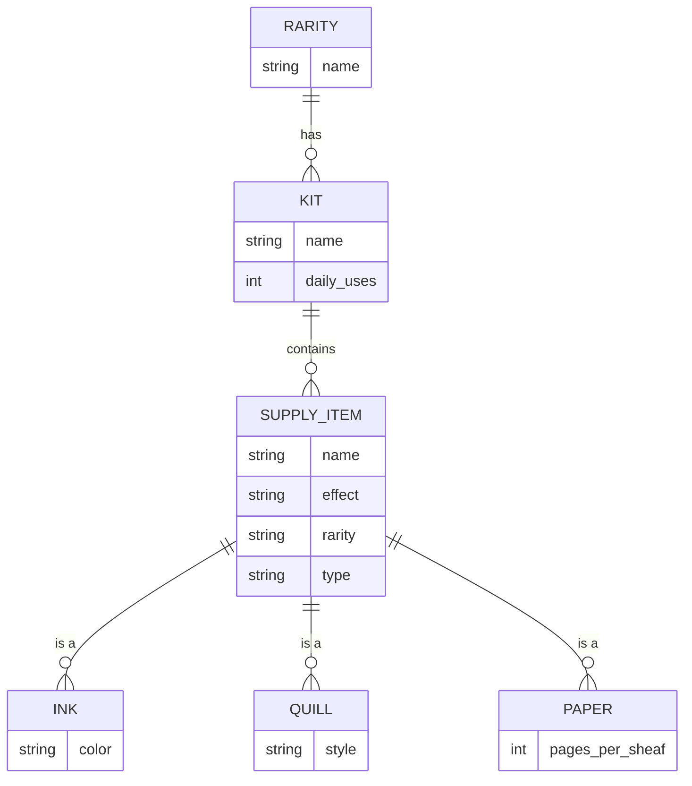

# A collection of Markdown for Homebrewery

- [_The Witch_](./witch.md) &mdash; A D&amp;D 5e (2024) spellcasting class.
  Not a Cleric, Druid, Sorcerer, Warlock, nor Wizard. Definitely not a
  martial.
  Focus is on **the personal and classic Witch archetypes.**
  Cackling is optional.
  See [Homebrewery](https://homebrewery.naturalcrit.com/edit/acC04Sqxbdca) for
  online rendering.
  (D&amp;D Beyond does not support custom classes, only subclasses.)
   - [_Aura of Calm_](./aura-of-calm.md) &mdash; a witchy spell for _Mother_
     subclass.
     See [D&amp;D
     Beyond](https://www.dndbeyond.com/spells/3008065-aura-of-calm)
     or [Homebrewery](https://homebrewery.naturalcrit.com/edit/6qsmSyMl-Sck)
     for online rendering.
   - [_Harsh Glare_](./harsh-glare.md) &mdash; a witchy Cantrip.
     See [D&amp;D
     Beyond](https://www.dndbeyond.com/spells/3008061-harsh-glare).
     or [Homebrewery](https://homebrewery.naturalcrit.com/edit/ryns87mhYTtr)
     for online rendering.
- Alternative Goliath ancestries (2024 D&amp;D 5e)
   - [_Ettin Ancestry_](./ettin-ancestry.md) &mdash; An alternative species
     for Goliath&rsquo;s _Giant Ancestry_ feature.
     Focus is on **psychic damage and defense**.
     See [D&amp;D
     Beyond](https://www.dndbeyond.com/feats/2092753-ettin-ancestry) or
     [Homebrewery](https://homebrewery.naturalcrit.com/edit/0rIVxQJVCTxD) for
     online rendering.
   - [_Troll Ancestry_](./troll-ancestry.md) &mdash; An alternative species
     for Goliath&rsquo;s _Giant Ancestry_ feature.
     Focus is on **self-healing through regeneration**.
     See [D&amp;D
     Beyond](https://www.dndbeyond.com/feats/2092667-troll-ancestry) or
     [Homebrewery](https://homebrewery.naturalcrit.com/edit/IeQ0kNxoqhVg) for
     online rendering.
- [_Scribe&rsquo;s Supplies_](./scribes-supplies.md) &mdash; An improved
  and magical version of _Calligrapher&rsquo;s Supplies_.

### Scribe&rsquo; Supplies

